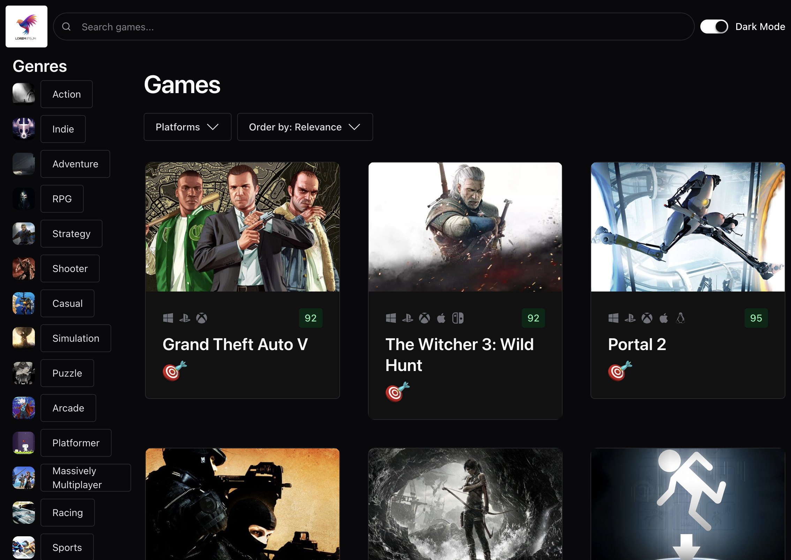
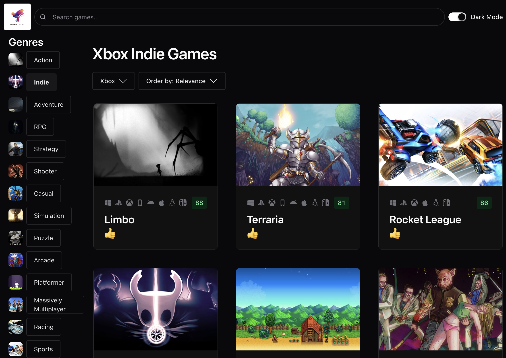

# 🎮 Game Hub

A modern React application for discovering video games, built as part of a course by Mosh Hamedani. This project demonstrates practical front-end development skills including API integration, responsive design, and reusable component architecture.

<!-- ## 🚀 Live Demo
👉 [View Live App](#)
*(Add your deployed link here – e.g. Vercel / Netlify)* -->

---

## 🧠 About the Project

Game Hub is a game discovery platform that allows users to browse, search, and filter video games across different genres, platforms, and ratings.

The goal of this project was to build a scalable and maintainable React application using best practices and modern tools.

---

## ✨ Key Features

- 🔍 **Search functionality** – quickly find games by name
- 🎯 **Advanced filtering** – filter by genre, platform, and sort order
- 📊 **Game ratings & metadata** – view critic scores and details
- 🖼️ **Responsive UI** – works seamlessly across devices
- ⚡ **Fast performance** – optimized API calls and rendering
- 🧩 **Reusable components** – clean and modular architecture

---

## 🛠️ Tech Stack

- **React**
- **TypeScript**
- **Vite**
- **Chakra UI**
- **Axios**
- **React Query (TanStack Query)**

---

## 📸 Screenshots

### 🏠 Home Page



### 🔎 Search & Filter


### 🎮 Game Listings



### 📱 Responsive View


<!-- > 💡 Tip: Create a `/screenshots` folder in your repo and add images with these names, or update paths accordingly. -->

---

## 🧱 Project Structure

```
src/
├── components/    # Reusable UI components
├── hooks/         # Custom React hooks
├── services/      # API logic
├── types/         # TypeScript definitions
├── pages/         # Page-level components
└── App.tsx
```

---

## ⚙️ Installation & Setup

Clone the repository:

```bash
git clone https://github.com/jedrekszor/game-hub.git
cd game-hub
```

Install dependencies:

```bash
npm install
```

Run the development server:

```bash
npm run dev
```

---

## 🌐 API

This project uses the **RAWG Video Games Database API**.

To run locally, you may need to:

1. Create an account at https://rawg.io/apidocs
2. Generate an API key
3. Add it to your environment variables

Example:

```
VITE_RAWG_API_KEY=your_api_key_here
```

---

## 📈 What I Learned

- Building scalable React applications with TypeScript
- Managing server state with React Query
- Designing reusable and maintainable components
- Working with external APIs and handling async data
- Creating responsive and accessible UI

---

## 📬 Contact

If you're a recruiter or developer interested in my work, feel free to connect:

- GitHub: [github.com/jedrekszor](https://github.com/jedrekszor)
- LinkedIn: [linkedin.com/jedrzej-szor](https://www.linkedin.com/in/j%C4%99drzej-szor-89b8761ab/)

---

## 🙌 Acknowledgements

Project inspired by a course from Mosh Hamedani.
